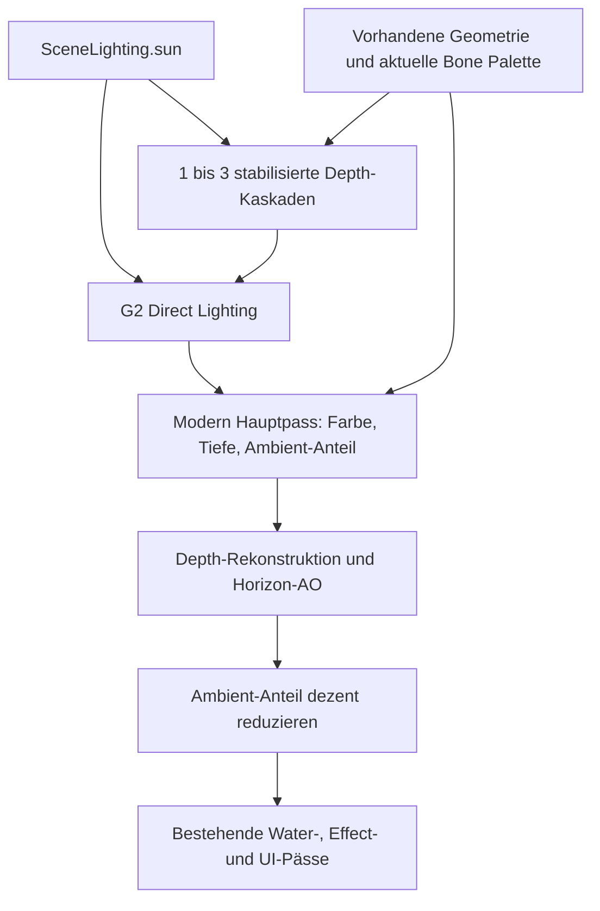

# G3/4-X — Shadows & Ambient Depth

Stand: 15.09.2026. Windows x64, Diligent D3D11; portable Mathematik unter GCC/LP64.

**Abnahmestatus: GO.** Release 81/81, Debug 81/81, GCC/LP64 49/49, zwölf Classic-Goldens bytegleich und manuelle G3/4-Spielabnahme bestätigt. Automatische und bestätigte manuelle Läufe enden mit Exitcode 0 und erfassten Ressourcenständen 0. Eine ältere G2-Bestätigung wurde nicht auf G3/4 übertragen. Die unten verlinkten Abschlussdateien enthalten die endgültigen Build-, Test- und Artefaktdaten.

- [Interaktive Vergleichsgalerie](../../build/g34x/gallery.html)
- [Validierung und Artefakte](../../build/g34x/validation-summary.json)
- [Performance-Stichprobe](../../build/g34x/performance.md), [Messwerte einschließlich p95](../../build/g34x/performance.json)
- [Vollständiger Source-Diff einschließlich neuer Dateien](../../build/g34x/source.diff), [isolierter UI-Diff](../../build/g34x/graphics-ui.diff)

## 1. Baseline Audit

Ausgangspunkt ist G2-X. Der Hauptpfad ist ein Forward-Renderer mit RGBA8_UNORM-Farbe und D24_UNORM_S8_UINT-Tiefe. Es gibt keinen gemeinsamen Normalbuffer und keinen Depth-Prepass. PBR-Objekte, GPU-Actors, native Vegetation und Terrain-Splats lesen den zentralen G2-Lichtpuffer.

Der alte dynamische Character-Shadow-Pfad in `MapOutdoorCharacterShadow.cpp` ist bereits eine leere Kompatibilitätsschnittstelle: keine dynamische Shadow-Map und kein funktionierender Actor-Shadow-Renderpass. Alte Terrain-/Objekt-ShadowReceiver- und CameraBlocker-Zustände bleiben im Classic-Pfad erhalten. Sie sind nicht die Grundlage der neuen Sonnenschatten. Es wurde kein neuer Blob-/Projektionsschatten hinzugefügt.

Gemeinsam bleiben Geometrie, Texturen, Materialzustände, Skinning-Paletten, Terrain-Patches, native Bauminstanzen, Wind und LOD-Auswahl. G3/4 ergänzt Modern-Pässe; Classic behält seine Farbshader und Einstellungen.

## 2. Architecture

`Graphics/ShadowAmbient` enthält Windows-freie Konfiguration/Mathematik. `DiligentShadowAmbient` besitzt GPU-Ziele und Pässe. Terrain und StaticObjectRenderer besitzen ihre gecachten Caster-Varianten. `TerrainPresentation` koordiniert die einmalige Actor-Vorbereitung und die Kaskaden; `RenderGame` setzt den Pass vor die normale opaque Weltdarstellung.

## 3. Sun Direction Convention

`SceneLighting.sun.direction` bedeutet **Weltoberfläche → Sonne**, im bestehenden Z-up-Weltsystem. Die Lichtkamera blickt entlang `-sun.direction`. Es existiert keine zweite dauerhafte Sonnenrichtung. Die Kamera verwendet wie G2 ein rechtshändiges System mit negativer View-Z-Tiefe; die orthografische Projektion bildet diese auf D3D-Tiefe 0–1 ab.

## 4. Shadow System

Kompaktes Cascaded Shadow Mapping mit D32_FLOAT-Depth-Array, je Kaskade eigener DSV und gemeinsamer Array-SRV. Ein neutraler 1×1-Tiefenfallback bleibt für gültige Shaderbindungen vorhanden. Off rendert keine Kaskade. Allocation-/Matrixfehler deaktivieren den betroffenen Effekt sicher.

## 5. Cascade Strategy

| Stufe | Kaskaden | Auflösung je Kaskade | Reichweite | PCF-Abtastungen |
|---|---:|---:|---:|---:|
| Aus | 0 | — | — | 0 |
| Niedrig | 1 | 1024² | 3000 cm | 3×3 |
| Mittel | 2 | 2048² | 5000 cm | 3×3 |
| Hoch | 3 | 2048² | 7500 cm | 3×3 |
| Ultra | 3 | 2048² | 9000 cm | 5×5 |

Die alte persistierte Zwischenstufe `LegacySolo` wird intern wie Niedrig behandelt; im Menü gibt es fünf Einträge.

## 6. Cascade Splits

Praktische linear/logarithmisch gemischte Splits mit Lambda 0,65. Near kommt aus der Kamera-Projektion; Far ist das Minimum aus Sichtweite, Qualitätsdistanz und Kamera-Far. Keine verteilten Split-Konstanten. Die letzte Splitgrenze entspricht exakt der wirksamen Schattendistanz.

## 7. Stabilization

Jeder Split verwendet eine umschließende Kugel, auf 16 cm gerundeten Radius und Texel-Snapping in Light-X/Y. Ein kleiner Rand schützt gegen Snapping-Abschneiden. Kaskaden überlappen um 10 %; der Receiver blendet an den Übergängen. Die letzten 10 % der Gesamtreichweite blenden zu unverschattet aus. Der Subtexel-Translationstest besteht. Der Nutzer bestätigte auch die manuelle Prüfung mit Bewegung, Kamera und Zoom als visuell in Ordnung.

## 8. Shadow Distance

Alle Werte kommen aus `GraphicsRuntimeConfig.shadowConfig`. Maximal drei räumlich begrenzte Frusta und 2500 cm zusätzliche Caster-Reichweite in Sonnenrichtung. Keine kilometergroße Schatten-Farplane.

## 9. Resolution

1024² oder 2048², maximal 48 MiB für drei D32-Kaskaden. Ultra erhöht den Filter und moderat die Distanz. Keine 4096²-Maps und keine Floating-Point-Farbtargets für Schatten.

## 10. Filtering

Comparison-Sampler mit linearer Filterung plus 3×3 beziehungsweise 5×5 PCF. Keine PCSS-/Raytracing-/Temporal-Abhängigkeit. Der Vergleich bleibt bei vollständig beleuchteten Punkten neutral.

## 11. Bias

Zentrale Vorgaben in `ShadowQualityConfig`: normalisierter Receiver-Depth-Bias 0,00015, Slope-Faktor 1,25, Normal-Offset 0,6 cm und Raster-Depth-Bias 2. Static-, Skin-, Vegetation- und Terrain-Caster verwenden dieselbe Rastervorgabe. Die Raster-PSOs cachen die festen Vorgaben; es gibt keinen öffentlichen Live-Bias-Regler. Thin-card-, Frontface- und Hügeltests sowie die bestätigte manuelle Kamera-/Zoomprüfung decken den begrenzten Milestone ab; keine Behauptung einer vollständigen Prüfung aller Kartenflächen.

## 12. Terrain

Der Schattenpass verwendet originale Terrain-Vertex-/Indexbuffer. Die normale Quadtree-Traversierung prüft das jeweilige Shadow-Frustum; die Shadow-Ausgabe umgeht den Farb-Splat-Layer-Limit und zeichnet Geometrie einmal pro Patch/Kaskade. Modern-Splats empfangen die Kaskaden. Classic-Splats bleiben unverändert.

## 13. Static World

Opaque und alpha-getestete Gebäude, Mauern, Felsen und Props laufen über denselben StaticObject-Caster. Der native B1-Nachweis zeigt Gebäudeschatten auf Terrain und Schattenempfang an Strukturen. Keine Asset-Sonderrenderer oder neue Meshkopien.

## 14. Actors

Player, NPC, Mob, Boss und Mount werden in der nativen A1/B1-Fixture erzeugt. Kameraferne Instanzen innerhalb eines relevanten Lichtfrustums können weiterhin Schatten werfen. Unsichtbarkeits-Affects werden durch den bestehenden Actor-Renderfilter weiterhin ausgeschlossen.

## 15. GPU-skinned Casters

Die Actor-Vorbereitung läuft einmal für die Vereinigung von Kamera- und Shadow-Frusta. Alle Kaskaden und der Hauptpass benutzen dieselbe aktuelle GPU-Palette und dieselben Vertex-/Indexbuffer. Kein CPU-Shadowmesh, keine zweite Pose-Auswertung. Native Abschlusszähler: CPU-Deformation 0, GPU-Fallbacks 0, Skin-Preparation-Fehler 0.

## 16. Attachments

Weapon/Hair bleiben an den vorhandenen Model-/Bone-Transforms. Der zusätzliche native GLB-Test bindet `hand_prop.glb` an RightHand, vergleicht dessen Weltmatrix mit der Handmatrix und isoliert seinen Schattenbeitrag: 128 zusätzliche dunklere Pixel in der Attack-Aufnahme. Idle/Walk/Attack werden über die echten geladenen Clips geprüft.

## 17. Vegetation

Native ZiiNAN-Branches, Fronds, Leaves und bestehende Billboards verwenden ihre normalen Auxiliary-Streams, Card-Basis, Windparameter und Texturen. Culling und Qualitätsdistanz bleiben Teil derselben Baumwelt. Keine zweite Vegetationsverwaltung; keine H2-Funktionen.

## 18. Alpha-tested Shadows

Der Shadow-Pixelshader übernimmt Texturalpha, Materialfaktor, Material-UV-Transformation und den bestehenden Cutoff-Vergleich. Der Kreuzmasken-GPU-Test vergleicht gegen eine volle Karte: die ausgeschnittenen Bereiche werfen keinen Rechteckschatten. B1-Baumaufnahmen ergänzen die synthetische Probe.

## 19. Double-sided Shadows

Rigid, skinned und Auxiliary-Caster besitzen die drei bestehenden Cull-Varianten. Main und Shadow respektieren dieselbe Frontface-Konvention. Ein GPU-Test verlangt bei einer von vorn gesehenen maskierten Fläche bytegleiche Bilder für cull-none und den passenden einseitigen Zustand. Dieser Test deckte eine zunächst linkshändige Shadow-Kamera auf; sie wurde korrigiert.

## 20. Shadow Receiver Semantics

Nur `DirectSun` wird mit der Shadow-Visibility multipliziert. Hemisphärischer Ambient-Anteil bleibt beleuchtet. Receiver existieren in PBR, Terrain-Splat und nativer Vegetation. Transparente Effekt-/Wasserpässe bleiben außerhalb der neuen opaque Casterfolge.

## 21. Material AO Interaction

Material-AO beeinflusst bereits den Ambient-Anteil aus G1. Screen-Space-AO reduziert ausschließlich diesen verbleibenden Anteil. Direktes Sonnenlicht, Schattenberechnung und Emission werden nicht pauschal mit AO multipliziert. Im GPU-Test sind Direct-only-Bilder mit AO aus/hoch bytegleich.

## 22. GTAO Architecture

Eine begrenzte GTAO-artige Horizon-Technik: feste Winkelrichtungen, beidseitige quadratische Radiusschritte, pro Richtung maximaler lokaler Horizont. Sie ist eine Screen-Space-Annäherung ohne vollständige GTAO-Referenzimplementierung oder zusätzliche SSAO-Technik. Ein zusätzlicher RGBA8-MRT speichert den tatsächlich darstellbaren linearen Ambient-Beitrag; der Composite zieht nur dessen verdeckten Anteil von der LDR-Szene ab. Kein HDR-Rendererumbau.

## 23. Depth Input

Die vorhandene D24S8-Szenentiefe wird nach der opaque Szene in eine shaderlesbare R24G8-Typeless-Textur kopiert, mit R24_UNORM_X8-SRV. Kein zweiter Geometriedurchlauf für AO. Ein gezielt fehlendes Depth-Input lässt das schattierte Farbbild bytegleich unverändert.

## 24. Normal Input

View-Normalen werden aus benachbarten rekonstruierten Positionen abgeleitet. Je Achse wird die Seite mit der kleineren Tiefendifferenz gewählt; das begrenzt Silhouettenübersprechen. Es gibt keinen zusätzlichen Normalbuffer und keine Leaf-AO-Simulation.

## 25. Position Reconstruction

Inverse der tatsächlichen Projektion einschließlich der vorhandenen D3D11-Pixelzentrumskorrektur. Tests umfassen Near, Far, Bildschirmmitte, Ecken, mehrere Seitenverhältnisse und einen realen Resize von 320×240 auf 400×300 und zurück.

## 26. AO Radius

60 cm im bestehenden Clientmaßstab, validiert auf 5–150 cm; zusätzlich begrenzter Bildschirmradius. Kein mehrere Meter großer Actor-Halo.

## 27. AO Intensity

Faktor 0,45, maximale lokale Sichtbarkeitsreduktion 0,35. Die Wirkung wird nur auf Ambient angewendet und mit Entfernung zwischen 2000 und 5000 cm ausgeblendet. In der kleinen Kontakt-Fixture werden 173 von 76800 Pixeln um mindestens drei Rotkanalstufen verändert.

## 28. AO Filtering

3×3 bilateraler Composite, gewichtet nach Tiefe und rekonstruierter Normale. Low wird dabei tiefenbewusst hochskaliert. Keine History-Texturen, keine TAA-Voraussetzung, keine zufällige Frame-Rotation.

## 29. Quality Levels

AO Aus: keine AO-Ziele/Pässe. Niedrig: halbe Breite/Höhe, vier Richtungen mit je vier Schritten pro Seite. Hoch: volle Auflösung, sechs Richtungen mit je sechs Schritten pro Seite. Das Menü zeigt ausschließlich Aus/Niedrig/Hoch.

## 30. Graphics Settings

Das vorhandene Grafikfenster enthält Sonnenschatten und Umgebungsverdeckung. Die native UI-Motivgruppe zeigt die fertige Oberfläche mit Laufzeitanwendung; der Hinweis nennt den Modern-Modus. Alte Konfigurationswerte bleiben lesbar. Der isolierte UI-Diff enthält nur die Änderungen dieses Milestones am bereits vorhandenen unversionierten Grafikdialog.

## 31. Presets

Low: Schatten aus/AO aus. Medium: Schatten Mittel/AO Niedrig. High: Schatten Hoch/AO Hoch. Ultra: Schatten Ultra/AO Hoch. Einzeländerungen ergeben Custom. Die historischen Namen SSAO/GTAO bleiben lediglich kompatible Enum-Aliase; es existiert ein AO-Algorithmus.

## 32. Runtime Toggle

Menüauswahl wendet den vorhandenen G0-Konfigurationspfad an. Schatten-Arrays werden nur bei tatsächlichem Qualitäts-/Kaskadenwechsel ersetzt; AO-Ziele nur bei benötigter Größenänderung. G3/4 hat keine Neustartpflicht.

## 33. Classic Compatibility

Classic aktiviert keine Kaskaden und keine AO-Targets. Neutraler Depth-Fallback und gecachte PSOs können als Rendererbesitz bestehen bleiben. Die zwölf Classic-Goldens werden anhand der G2-SHA256-Baseline geprüft, nicht anhand neu erzeugter Sollbilder.

## 34. Sun Direction Proof

Portable Projektion: Oberfläche und analytischer Schattenpunkt teilen Light-X/Y; der Caster liegt im Licht näher. GPU-Probe: Gegenrichtungen verschieben den gewichteten Schattenmittelpunkt von ungefähr (178,8;133,0) nach (138,9;120,1). Geometrie und Kamera bleiben identisch.

## 35. Shadow Length Proof

Bei niedrigerer Elevation wächst die messbare Schattenfläche um mehr als den geforderten Testfaktor 1,25. Morning-/Noon-/Evening-artige Richtungen sind reine Development-Fixtures; kein Day/Night-System.

## 36. Player Proof

Vier feste Kamerabilder: Classic → G2 → Shadows → Shadows+AO. Der native Player trägt Waffe und Hair; NPC daneben. Die korrigierte Integration akzeptiert den normalen vollständigen Actor-Viewport. Ein eigener GPU-Test verhindert die Regression, bei der dieser Viewport zunächst fälschlich ausgeschlossen wurde.

## 37. Mob Proof

Echter nativer GR2-Bär mit NPC/Boss im Bild; gerichteter Schatten auf dem Boden und zurückhaltender AO-Kontakt. Identische Assets und feste Kameraposition über vier Stufen.

## 38. Building Proof

B1-Mauer/Turm mit Schatten auf Terrain. Vorhandene Materialien und Geometrie bleiben gleich. Schatten empfangen DirectSun korrekt; Ambient bleibt erhalten. Ein großzügig dunkler Ausgangseindruck mancher G2-Texturen wird nicht als durch AO verursachte Änderung ausgegeben.

## 39. Vegetation Proof

B1-Nahaufnahme mit nativer Baumkrone, Zweigen und Terrainkontakt. Die zusätzlichen maskierten GPU-Karten liefern den überprüfbaren Alpha-/Cull-Nachweis. Originale Wind-/Card-Verformung wird in beiden Pässen wiederverwendet; für fixe native A/B-Paare ist die vorhandene Development-Windzeit eingefroren.

## 40. Animated GLB Proof

Native Weltgalerie mit Idle, Walk und Attack. Idle ist positions-/posegleich; Walk/Attack sind laufende Animationsaufnahmen und deshalb keine pixelgleichen Pose-Paare. Der separate native GLB-GPU-Test stellt für jeden Clip dieselbe Zeit ein, benutzt die normale ResourceManager-/Animation-/Actor-Kette und prüft den Hand-Prop-Beitrag. Zusätzlich beweist eine isolierte Palette-Translation, dass Main und Shadow dieselben animierten Vertices verwenden.

## 41. Terrain Proof

A1/B1-Galerie mit Originalterrain sowie gezielte Höhenrücken-Fixture auf dem echten Terrain-Caster und Modern-Splat-Receiver. Die Fixture erzeugt 6535 lokal dunklere Pixel; weit entfernte flache Bereiche bleiben unverändert. Ihre vereinfachten Normalen dienen dem eindeutigen Geometrie-/Schattennachweis, nicht einer neuen Terrain-Lichtreferenz.

## 42. Performance

Kurze lokale Stichprobe bei 1024×768 und aktiviertem VSync, ohne Langzeit-/Stresslauf. Gemessen werden CPU-Frame ohne Present/Frame-Limiter, GPU-Frame, Shadow-Draws, eindeutige Mesh/World-Caster, Shadow-CPU und AO-CPU/GPU. Die ersten zehn und letzten zwei Frames je Schritt werden verworfen. Vollständige Mediane/p95/Samplezahlen: [Performance](../../build/g34x/performance.md).

| Motiv | Classic CPU/GPU ms | G2 CPU/GPU ms | G3/4 High CPU/GPU ms | AO GPU ms | Shadow Draws/Caster |
|---|---:|---:|---:|---:|---:|
| Player/NPC | 0,732 / 0,061 | 0,731 / 0,080 | 1,047 / 0,653 | 0,419 | 191 / 67 |
| B1 Building | 0,546 / 0,078 | 0,563 / 0,087 | 0,765 / 0,401 | 0,182 | 102 / 82 |
| B1 Vegetation | 0,564 / 0,085 | 0,609 / 0,127 | 0,843 / 0,539 | 0,211 | 118 / 79 |

Die manuelle Testkopie konnte parallel aktiv sein. Die Zahlen belegen verfügbare und begrenzte Passkosten in dieser lokalen Stichprobe; sie sind kein isolierter Hardwarebenchmark oder belastbarer FPS-Vergleich.

High: 48 MiB Schatten und 9,75 MiB AO-Ziele bei 1024×768. Low-AO: 9,1875 MiB. Größen enthalten die Effekttexturen, nicht die schon vorhandene Swapchain, Geometrie oder Treiberallokationen. Die Messung ist eine Sanity-Prüfung, kein allgemeines GPU-Leistungsversprechen.

## 43. Culling

Terrain-Quadtree gegen die jeweilige Lichtkaskade; Objektsphären gegen das Shadow-Frustum; zusätzliche transformierte Bounds-Prüfung für starre Meshes und Windreserve für Auxiliary-Geometrie. Actors werden einmal für die Frusta-Vereinigung vorbereitet, dann pro Kaskade gefiltert. Die gesamte Map wird nicht dreimal gezeichnet. `shadowCasters` zählt eindeutige Mesh+World-Instanzen, nicht Figuren oder Draw-Materialgruppen.

## 44. PSO Strategy

Neun Castervarianten pro GPU-fähigem StaticObjectRenderer (rigid/skinned/auxiliary × Cull), sechs im rein statischen Besitzer und zwei Terrain-Topologien. Nativer Client: 17 gecachte Shadow-PSOs; AO: zwei Fullscreen-PSOs. Alpha-Masking bleibt shadergesteuert. Vorhandene Modern-PBR-/Vegetation-/Terrain-Receiver haben begrenzte MRT-Varianten. Keine Qualitätsvarianten-Kompilierung bei jedem Frame.

## 45. Resource Lifetime

Map-/Style-Reset entfernt Shadow-Arrays, ihre DSVs und AO-Ziele/SRBs. Receiver-Bindings werden nach einem Draw auf den neutralen Fallback zurückgesetzt, damit ein SRB keine alte Map festhält. PSOs, konstante Buffer und Sampler sind Rendererbesitz bis Shutdown. Optionale Benchmark-Duration-Queries sind auf 16 Slots begrenzt und werden freigegeben.

## 46. Resize

AO-SRBs und größenabhängige Ziele werden vor Resize invalidiert/freigegeben. Shadow-Auflösung ist fensterunabhängig. GPU-Tests prüfen neue Zielgrößen und Bildausgabe nach Wiederherstellung. Native Window-Fixture prüft Resize/Minimize/Restore und anschließende Darstellung.

## 47. Map Transition

Native Folge A1 → B1 → A1, neue Lichtrevisionen und keine alten Map-Ziele nach Reset. Die normale Spielerreise war zusätzlich Teil der ausdrücklich bestätigten manuellen Abfrage.

## 48. Quality Toggle

Kurze GPU-Folge Off → Low → High → Ultra → Off → High, AO aus/niedrig/hoch/aus, mehrfacher Style-Wechsel und native Persistenz über drei echte Prozesse. Feste Ressourcenstände je Zustand; kein Wachstum über Wiederholungen.

## 49. Validation

Acht neue G3/4-Tests: Config, Splits, Sun, Stabilization, Reconstruction, Boundary, Render und NativeCharacter. Ungültige Distanz/Kaskadenzahl/Bias, Null-/NaN-Sonne, AO-Parameter, singuläre Projektion und fehlender Depth-Input sind geprüft. Der neue GPU-Test lehnt Diligent-Warnungen/Fehler ab.

Zwischenfehler sind nicht als PASS gewertet: Actor-Viewport-Ausschluss, falsche Shadow-Handedness und ungebundener Clear wurden korrigiert. Eine zunächst fehlende Diligent-Include-Freigabe des Testziels wurde behoben; maßgeblich sind ausschließlich die erfolgreich neu gebauten und danach ausgeführten Abschlussgates.

## 50. Portability

Öffentliche Konfiguration und Kaskaden-/Inverse-Mathematik enthalten ausschließlich Standard-C++ und bestehen unter GCC/LP64. Diligent-Ressourcen bleiben Renderer-intern. D32-Depth-Arrays, SRVs und Comparison-Sampler verwenden Diligent-Schnittstellen. Ein ausführbarer Vulkan-/Android-Pass ist in diesem Milestone nicht implementiert oder geprüft.

Die [Importprüfung des fertigen Release-Binary](../../build/g34x/binary-dependencies.txt) zeigt D3D11/DXGI, keine D3D9-, Granny- oder SpeedTree-DLL. Der bestehende DDRAW-Import ist weiterhin vorhanden; G3/4 entfernt nicht pauschal alle historischen Windows-Abhängigkeiten.

## 51. Release

Vollständiger CMake-Release-Build plus begrenztes relevantes Gate mit 81 Tests. Nachweise: `release-build-validation.log` und `release-gate-validated.log`. Keine Fuzzer-, 30-Minuten- oder vollständige GR2-Langzeitsuite.

## 52. Debug

Vollständiger Debug-Build und dasselbe Gate: **81/81 PASS** in 86,90 Sekunden. Der erste Abschlussversuch fand die Diligent-Clear-Warnung über `HairLodQuick`; nach Korrektur bestanden beide gezielten strengen Tests und das gesamte Gate. Endgültiger Gesamtstatus steht in `debug-gate-validated.log` und der Validierungsübersicht.

## 53. GCC / LP64

49/49 portable relevante Tests einschließlich der sechs neuen Mathematik-/Config-Tests. Das umfasst vier Platform-Tests. Eine Cygwin-Schreibrechte-Sperre im eingeschränkten Lauf wurde im etablierten lokalen Buildkontext erneut geprüft; sie wird nicht als Produktfehler ausgegeben.

## 54. G1 Regression

Material-Mapping, Validierung, Overrides, Tangents, Settings, GR2-Override, GPU-Materialtest, echtes GLB und Character-PBR gehören zum Gate. Bestehende Material-/Texturkonventionen bleiben erhalten.

## 55. G2 Regression

Validation, MapConversion, Revision, Settings, HeaderBoundary, GPU-Lighting und Material-Balls bestehen weiterhin. Schatten aus/AO aus bleibt der G2-Modern-Zustand.

## 56. GR2 Regression

Native Zero-Audit, Golden/Compatibility/Safety, Redthief-Repair, Warmup und Hair-/LOD-GPU-Nachweis bleiben enthalten. Die native Galerie ergänzt Player, Mob, Boss, Weapon, Hair, Mount und Building. Kein Granny-Fallback.

## 57. GLB Regression

Provider-/Consumer-, statische und animierte GPU-Pfade, WideIndices und EmbeddedMaterial bleiben im Gate. Der neue native Schattennachweis benutzt dieselben Resource-/Actor-Typen und aktuelle GPU-Paletten.

## 58. Vegetation Regression

Contracts, Boundary, Goldens, RenderGoldens und NoLegacyDependency im Gate; native A1/B1-Coverage. SpeedTree bleibt entfernt. Keine neuen Vegetationsassets.

## 59. Client Smoke

**Automatisierte native Fixture: PASS** mit vier Zuständen für neun Motive, A1/B1/A1, Fensterprüfung und drei Neustarts. **Normale Login-/Spielabnahme: PASS.** Nach ausdrücklich gewünschtem Neustart der aktuellen Testkopie bestätigte der Nutzer: „Alles geprüft, visuell in Ordnung und Client geschlossen“. Die Abfrage umfasste Login, Charakterauswahl, Bewegung/Kampf, Kamera/Zoom, Schatten-/AO-Umschaltung, A1 → B1 → A1 und reguläres Schließen.

`manual-validated` verwendet genau das finale Release-Binary. `renderer-startup.log` protokolliert ExitCode=0; SourceResourceAudit und alle acht Renderer-Shutdownzeilen sind 0. Aktivität: 280504 PBR-Draws, 429281 Modern-Terrain-Draws, 185967 Modern-Vegetation-Draws und 397131 GPU-Frames. CPU-Deformation, GPU-Fallbacks sowie Skin-/Animation-/Vegetation-Fehler bleiben 0. [Manuelle Abnahme](../../build/g34x/manual-acceptance.json).

Die manuelle syserr-Datei ist nicht leer: das bekannte `invalid idx 0` beim Login und vorhandene Damage-Effekt-Diagnoseausgaben. Keine neuen Python-/Material-/Asset-/Vegetation-Fehler und keine Renderer-Failure-Meldung im bestätigten Lauf.

## 60. Visual Gallery

36 native Hauptaufnahmen, vier weitere Persistenzbilder und GPU-Nachweise. [Galerie](../../build/g34x/gallery.html) erlaubt Vergleich nebeneinander oder Umschaltung auf eine Stufe. Die originalen Bilder wurden nicht nachbearbeitet. Player, Mob, Terrain, Building, Vegetation und GLB sind getrennt auffindbar.

## 61. Classic Goldens

Zwölf vorhandene Classic-Bilder: drei Market-Stall-Kameras, sechs GLB-Clips, 20 Actors, Hand-Attachment und Window-Restore. SHA256-Vergleich mit G2: [Classic-Nachweis](../../build/g34x/classic-comparison.json). Keine Baseline-Neudefinition.

## 62. Shutdown

Automatische native Prozesse und der bestätigte normale Client enden regulär mit Exitcode 0. Acht Renderer-Shutdownzeilen und SourceResourceAudit werden pro Prozess gespeichert. Der manuelle Shutdown wurde anhand seiner eigenen Dateien geprüft und nicht aus dem Fixture-Ergebnis abgeleitet.

## 63. Resource Counts

Automatischer Abschluss: ShadowMaps/Views/Pipelines/Buffers = 0; AOTargets/Views/Pipelines/Buffers = 0; SceneLighting/Material/SourceTextures/SourceBuffers = 0; GR2/GLB/Animation/Vegetation/Collision = 0. CPUDeformation/GPUFallbacks/AnimationFailures/VegetationFailures = 0. Originalwerte: [nativer Ressourcenaudit](../../build/g34x/runtime/native-validated/source-resource-audit-0.log).

## 64. Known Limitations

- Die manuelle G3/4-Abnahme ist bestätigt; sie bleibt eine begrenzte Prüfung der angefragten Route und Situationen.
- Screen-Space-AO kennt verdeckte oder außerhalb des Bildes liegende Geometrie nicht. Tiefenrekonstruktion, Low-Auflösung und LDR-Ambient-Speicherung sind bewusst begrenzte Näherungen.
- Schatten sind auf die Qualitätsdistanz und drei Kaskaden begrenzt. PCF ersetzt keine temporale Kantenglättung. Transparente Effekte/Wasser sind keine opaque Caster.
- Statische Bilder und Subtexel-Mathematik beweisen nicht die subjektive Flimmerfreiheit bei jeder Bewegung und jedem realen Hügel.
- Vorhandene Build-Diagnostik bleibt sichtbar: insbesondere fehlende Python/zlib-PDBs (LNK4099), Library-Konflikthinweise (LNK4098) und G2-Shader-Compilerhinweise X4000. Kein pauschales „warning-free“.
- Die Hair-/LOD-Rohasset-Fixture meldet ihre bestehenden fehlenden alten DDS-Pfade, obwohl Geometrie-/Skinning-Parität besteht. Das ist von neuen Diligent-Warnungen getrennt.
- Kein Vulkan-/Android-Gerätenachweis und keine Langzeit-/Stress-/Fuzzbehauptung.
- Die frühere versteckte Testinstanz (PID 20992, vor dem gewünschten Neustart) wurde nach Windows-„Zugriff verweigert“ durch den Nutzer beendet und das Ende bestätigt. Sie wird als absichtlich beendeter Vorlauf geführt, nicht als erfolgreicher Shutdown-Nachweis. Die vier akzeptierten Läufe sind separat vollständig dokumentiert.

## 65. Git Diff

Nur lokale unstaged Änderungen. Neue Source-/Test-/Berichtsdateien sind im bereitgestellten Diff enthalten. Die bereits vorhandenen Änderungen im Asset-Checkout — unter anderem Redthief-GR2, `uisystemoption.py` und Channel-Konfiguration — wurden nicht zurückgesetzt oder als G3/4-Reparaturen ausgegeben. Keine Commits, kein Push, keine Build-/Capture-/Logdateien gestagt.

## 66. GO / NO-GO

**GO für G3/4-X.** Technische Gates, feste Bildnachweise, begrenzte Performance-Prüfung, Ressourcenprüfung, Classic-Parität und ausdrückliche manuelle Spielabnahme sind bestanden. Die frühere Testinstanz wurde aufgeräumt. Der maschinenlesbare Abschluss trennt PASS, nicht ausgeführte Prüfungen und den absichtlich beendeten Vorlauf.

## 67. Recommendation G5/6-X

G3/4 ist abgenommen; G5/6 kann gesondert geplant werden. In diesem Auftrag wurden HDR, Tone Mapping, Exposure, Bloom, Sun Disk, Sky/Fog/Atmosphere, Water, Day/Night und Vegetation 2.0 nicht begonnen. **STOP nach G3/4-X.**
